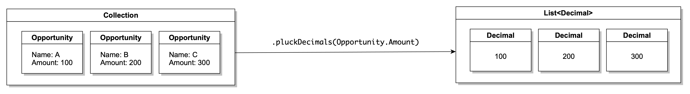
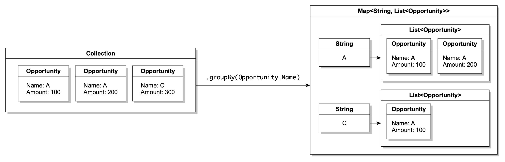
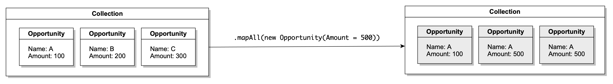
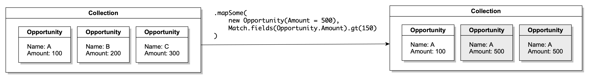
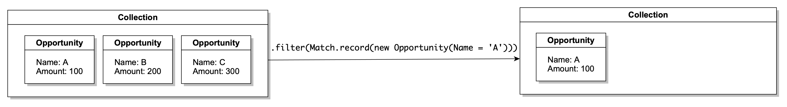

<p align="center">
  <h1 align="center"></h1>
</p>

Lambda provides functional constructs for `SObject` collections!

```apex
List<Account> accounts = new List<Account>{
    new Account(Name = 'Foo', AnnualRevenue = 50000),
    new Account(Name = 'Bar', AnnualRevenue = 30000)
}

SObjectCollection accountCollection = SObjectCollection.of(accounts);

SObjectCollection filtered = accountCollection.filter(Match.field(Account.AnnualRevenue).greaterThan(40000));
SObjectCollection mapped = filtered.mapAll(CopyFields.fromRecord(new Account(High_Value__c = true)));
SObjectCollection remaining = mapped.remove(Match.record(new Account(Name = 'Bar')));

SObjectStream accountStream = SObjectStream.of(accounts);
SObjectStream filteredStream = accountStream.filter(Match.field(Account.AnnualRevenue).greaterThan(40000));
while (filteredStream.hasNext()) {
    SObject account = filteredStream.next();
}
```

<a href="https://githubsfdeploy.herokuapp.com?owner=ipavlic&repo=apex-lambda&ref=master">
  
</a>

# Documentation

Lambda offers eager and lazy evaluation. 

Eager evaluation through `SObjectCollection` is stable, richer, easier to use and is not consumable.

Lazy evaluation through `SObjectStream` can be more efficient for large data sets and can be performed for only as long as required, but is consumable and has to be recreated for every use.

Lambda comes with a set of function factories, that can be used for both [`SObjectCollection`](#sobject-collection) and [`SObjectStream`](#sobject-stream) instances.

- [`SObjectCollection`](#sobject-collection)
- [`SObjectStream`](#sobject-stream)
- [`Function factories`](#function-factories)

## `SObjectCollection` functions
<a name="sobject-collection"></a>

- [`isEmpty`](#is-empty)
- [`difference`](#difference)
- [`filter`](#filter)
- [`remove`](#remove)
- [`groupBy`](#group-by)
- [`pick`](#pick)
- [`pluck`](#pluck)
- [`mapAll`](#map-all)
- [`mapSome`](#map-some)
- [`mapToDecimal`](#map-to-decimal)
- [`mapToDouble`](#map-to-double)

### `isEmpty`
<a name="is-empty"></a>

| Modifier and type | Method | Description |
|-------------------|--------|-------------|
| `Boolean` 		| `isEmpty()` 			| Returns `true` if this collection contains no elements. |

### `difference`
<a name="difference"></a>

| Modifier and type | Method | Description |
|-------------------|--------|-------------|
| `SObjectCollection` 		| `difference(SObjectCollection other, Set<Schema.SObjectField> comparisonFields)` 			| Returns a collection view of those records that are not equal in the `other` list, considering only `comparisonFields` in the comparison. |

### `filter`
<a name="filter"></a>

| Modifier and type | Method | Description |
|-------------------|--------|-------------|
| `SObjectCollection` 		| `filter(SObjectPredicate predicate)` 			| Returns a `SObjectCollection` view of records that satisfied predicate. |

Two predicates are provided out of the box, `FieldsMatch` and `RecordMatch`. They are instantiated through factory methods on `Match`.

```apex
SObjectCollection accountCollection = SObjectCollection.of(accounts);

Account prototype = new Account(Name = 'Foo');
SObjectCollection recordMatched = accountCollection.filter(Match.record(prototype));

SObjectCollection filtered = accountCollection.filter(Match.field(Account.Name).equals('Foo').also(Account.AnnualRevenue).greaterThan(100000));
```

### `remove`
<a name="remove"></a>


`remove` works just like `filter`, but records which match a predicate are removed from the `Collection` view instead of kept.

### `pluck`
<a name="pluck"></a>



Plucks field values from a `SObjectCollection` view of records into a `List` of appropriate type.

```apex
List<Account> accounts = new List<Account>{
	new Account(Name = 'Foo'),
	new Account(Name = 'Bar')
}
// Names are plucked into a new list, ['Foo', 'Bar']
List<String> names = SObjectCollection.of(accounts).pluckStrings(Account.Name);
```

Pluck can also be used for deeper relations by using `String` field paths instead of `Schema.SObjectField` parameters.

```apex
List<Opportunity> opportunities = new List<Opportunity>{
	new Opportunity(Account = new Account(Name = 'Foo')),
	new Opportunity(Account = new Account(Name = 'Bar'))
};

// Names are plucked into a new list ['Foo', 'Bar']
List<String> accountNames = SObjectCollection.of(opportunities).pluckStrings('Account.Name');
```

| Modifier and type | Method | Description |
|-------------------|--------|-------------|
| `List<Boolean>` | `pluckBooleans(Schema.SObjectField)` | Plucks Boolean `field` values |
| `List<Boolean>` | `pluckBooleans(String relation)` | Plucks Boolean `relation` values |
| `List<Date>` | `pluckDates(Schema.SObjectField field)` | Plucks Date `field` values |
| `List<Date>` | `pluckDates(String relation)` | Plucks Date `relation` values |
| `List<Date>` | `pluckDatetimes(Schema.SObjectField field)` | Plucks Datetime `field` values |
| `List<Date>` | `pluckDatetimes(String relation)` | Plucks Datetime `relation` values |
| `List<Decimal>` | `pluckDecimals(Schema.SObjectField field)` | Plucks numerical `field` values |
| `List<Decimal>` | `pluckDecimals(Schema.SObjectField field)` | Plucks numerical `relation` values |
| `List<Id>` | `pluckIds(Schema.SObjectField field)` | Plucks Id `field` values |
| `List<Id>` | `pluckIds(String relation)` | Plucks Id `relation` values |
| `List<Id>` | `pluckIds()` | Plucks values of `Id` field |
| `List<String>` | `strings(Schema.SObjectField field)` | Plucks String or Id `field` values |
| `List<String>` | `strings(Schema.SObjectField relation)` | Plucks String or Ids `relation` values |

### `groupBy`
<a name="group-by"></a>



Groups records by values of a specified field.

```apex
Map<Date, List<Opportunity>> opportunitiesByCloseDate = SObjectCollection.of(opportunities).groupByDates(Opportunity.CloseDate, opportunities);
```

| Modifier and type | Method | Description |
|-------------------|--------|-------------|
| `Map<Boolean, List<SObject>>` | `groupByBooleans(Schema.SObjectField field)` | Groups records by Boolean `field` values |
| `Map<Boolean, List<SObject>>` | `groupByBooleans(Schema.SObjectField field, Type listType)` | Groups records by Boolean `field` values, with specified list type |
| `Map<Boolean, List<SObject>>` | `groupByBooleans(String apiFieldName)` | Groups records by Boolean `apiFieldName` values |
| `Map<Boolean, List<SObject>>` | `groupByBooleans(String apiFieldName, Type listType)` | Groups records by Boolean `apiFieldName` values, with specified list type |
| `Map<Date, List<SObject>>` | `groupByDates(Schema.SObjectField field)` | Groups records by Date `field` values |
| `Map<Date, List<SObject>>` | `groupByDates(Schema.SObjectField field, Type listType)` | Groups records by Date `field` values, with specified list type |
| `Map<Date, List<SObject>>` | `groupByDates(String apiFieldName)` | Groups records by Date `apiFieldName` values |
| `Map<Date, List<SObject>>` | `groupByDates(String apiFieldName, Type listType)` | Groups records by Date `apiFieldName` values, with specified list type |
| `Map<Date, List<SObject>>` | `groupByDatetimes(Schema.SObjectField field)` | Groups records by Datetime `field` values |
| `Map<Date, List<SObject>>` | `groupByDatetimes(Schema.SObjectField field, Type listType)` | Groups records by Datetime `field` values, with specified list type |
| `Map<Date, List<SObject>>` | `groupByDatetimes(String apiFieldName)` | Groups records by Datetime `apiFieldName` values |
| `Map<Date, List<SObject>>` | `groupByDatetimes(String apiFieldName, Type listType)` | Groups records by Datetime `apiFieldName` values, with specified list type |
| `Map<Decimal, List<SObject>>` | `groupByDecimals(Schema.SObjectField field)` | Groups records by numeric `field` values |
| `Map<Decimal, List<SObject>>` | `groupByDecimals(Schema.SObjectField field, Type listType)` | Groups records by numeric `field` values, with specified list type |
| `Map<Decimal, List<SObject>>` | `groupByDecimals(String apiFieldName)` | Groups records by numeric `apiFieldName` values |
| `Map<Decimal, List<SObject>>` | `groupByDecimals(String apiFieldName, Type listType)` | Groups records by numeric `apiFieldName` values, with specified list type |
| `Map<Id, List<SObject>>` | `groupByIds(Schema.SObjectField field)` | Groups records by Id `field` values |
| `Map<Id, List<SObject>>` | `groupByIds(Schema.SObjectField field, Type listType)` | Groups records by Id `field` values, with specified list type |
| `Map<Id, List<SObject>>` | `groupByIds(String apiFieldName)` | Groups records by Id `apiFieldName` values |
| `Map<Id, List<SObject>>` | `groupByIds(String apiFieldName, Type listType)` | Groups records by Id `apiFieldName` values, with specified list type |
| `Map<String, List<SObject>>` | `groupByStrings(Schema.SObjectField field)` | Groups records by String `field` values |
| `Map<String, List<SObject>>` | `groupByStrings(Schema.SObjectField field, Type listType)` | Groups records by String `field` values, with specified list type |
| `Map<String, List<SObject>>` | `groupByStrings(String apiFieldName)` | Groups records by String `apiFieldName` values |
| `Map<String, List<SObject>>` | `groupByStrings(String apiFieldName, Type listType)` | Groups records by String `apiFieldName` values, with specified list type |

### `pick`
<a name="pick"></a>


Returns a new `SObjectCollection` view of the collection which keeps just the specified fields, discarding others. Helps reduce overwriting potential for concurrent updates when locking is not an option.

```apex
List<Opportunity> opportunities = new List<Opportunity>{
	new Opportunity(Name = 'Foo', Amount = 10000, Description = 'Bar')
}
// Picked contains just Name and Amount fields. Description is not present.
SObjectCollection picked = SObjectCollection.of(opportunities).pick(new Set<String>{'Name', 'Amount'});
```

| Modifier and type | Method | Description |
|-------------------|--------|-------------|
| `SObjectCollection` | `pick(List<Schema.SObjectField> fields)` | Picks fields into a new `SObjectCollection` view |
| `SObjectCollection` | `pick(Set<Schema.SObjectField> fields)` | Picks fields into a new `SObjectCollection` view |
| `SObjectCollection` | `pick(List<String> apiFieldNames)` | Picks fields into a new `SObjectCollection` view |
| `SObjectCollection` | `pick(Set<String> apiFieldNames)` | Picks fields into a new `SObjectCollection` view |

### `mapAll`
<a name="map-all"></a>



Maps all elements of `SObjectCollection` view into another `SObjectCollection` view with the provided `SObjectToSObjectFunction` mapping function.

| Modifier and type | Method | Description |
|-------------------|--------|-------------|
| `SObjectCollection` | `mapAll(SObjectToSObjectFunction fn)` | Returns a new `SObjectCollection` view formed by mapping all current view elements with `fn`. `SObjectToSobject` functions can be built by [`function factories`](#function-factories), or an instance of class that `implements` the `SObjectToSobject` interface can be provided. |


```apex
private class DoubleAmount implements SObjectToSObjectFunction {
    public SObject apply(SObject record) {
        record.put('Amount', 2 * (Decimal) record.get('Amount'));
        return record;
    }
}

List<Opportunity> opps = new List<Opportunity>{
    new Opportunity(Amount = 100),
    new Opportunity(Amount = 150)
};

SObjectCollection.of(opps).mapAll(new DoubleAmount()); // amounts have been doubled
```

One `SObjectToSObjectFunction` is provided out of the box, [`CopyFields`](#copy-fields). It is instantiated through a factory method, `CopyFields.fromRecord`

### `mapSome`
<a name="map-some"></a>



Returns a new `SObjectCollection` view formed by mapping those view elements that satisfy `predicate`, and keeping those that do not unchanged.

```apex
private class DoubleAmount implements SObjectToSObjectFunction {
    public SObject apply(SObject record) {
        record.put('Amount', 2 * (Decimal) record.get('Amount'));
        return record;
    }
}

List<Opportunity> opps = new List<Opportunity>{
    new Opportunity(Amount = 100),
    new Opportunity(Amount = 150)
};

SObjectCollection.of(opps).mapSome(Match.field('Amount').gt(120), new DoubleAmount()); // 100 remains, but 150 has been doubled to 300
```

| Modifier and type | Method | Description |
|-------------------|--------|-------------|
| `SObjectCollection` | `mapAll(SObjectToSObjectFunction fn)` | Returns a new `SObjectCollection` view formed by mapping current view elements that satisfy `predicate` with `fn`, and keeping those that do not satisfy `predicate` unchanged. |


### `mapToDecimal`
<a name="map-to-decimal"></a>


Maps a numeric field to a `DecimalCollection`. This is similar to `pluckDecimals`, but unlike a raw `List<Decimal>` returns a `DecimalCollection` which provides further functions.

| Modifier and type | Method | Description |
|-------------------|--------|-------------|
| `DecimalCollection` | `mapToDecimal(Schema.SObjectField field)` | Plucks Decimal `field` values into a `DecimalCollection`. |
| `DecimalCollection` | `mapToDecimal(String relation)` | Plucks Decimal values at `relation` into a `DecimalCollection`. |

Functions on `DecimalCollection` include `sum` and `average`.

| Modifier and type | Method | Description |
|-------------------|--------|-------------|
| `Decimal` | `sum()` | Sums non-null Decimal values. Returns `null` if no such values exist in the collection. |
| `Decimal` | `average()` | Averages non-null Decimal values. Returns `null` if no such values exist in the collection. |
| `DecimalCollection` | `filter(ObjectPredicate predicate)` | Filters all values satisfying the `predicate` into a new `DecimalCollection` view. |
| `DecimalCollection` | `filter(DecimalPredicate predicate)` | Filters all values satisfying the `predicate` into a new `DecimalCollection` view. |


### `mapToDouble`
<a name="map-to-double"></a>


Maps a numeric field to a `DoubleCollection`. This is similar to `pluckDoubles`, but unlike a raw `List<Double>` returns a `DoubleCollection` which provides further functions.

| Modifier and type | Method | Description |
|-------------------|--------|-------------|
| `DoubleCollection` | `mapToDouble(Schema.SObjectField field)` | Plucks Double `field` values into a `DoubleCollection`. |
| `DoubleCollection` | `mapToDouble(String relation)` | Plucks Double values at `relation` into a `DoubleCollection`. |

Functions on `DoubleCollection` include `sum` and `average`.

| Modifier and type | Method | Description |
|-------------------|--------|-------------|
| `Double` | `sum()` | Sums non-null Double values. Returns `null` if no such values exist in the collection. |
| `Double` | `average()` | Averages non-null Double values. Returns `null` if no such values exist in the collection. |
| `DoubleCollection` | `filter(ObjectPredicate predicate)` | Filters all values satisfying the `predicate` into a new `DoubleCollection` view. |
| `DoubleCollection` | `filter(DoublePredicate predicate)` | Filters all values satisfying the `predicate` into a new `DoubleCollection` view. |

```apex
List<Opportunity> opps = new List<Opportunity>{
    new Opportunity(Amount = 100),
    new Opportunity(Amount = 150)
};

Double average = SObjectCollection.of(opps).mapToDouble(Opportunity.Amount).average();
```

## Important notes on the type system in Apex
<a name="type-system"></a>

Apex allows assignment of `SObject` lists and sets to its “subclass”, and the other way around:

```apex
List<SObject> objects = new List<SObject>();
List<Account> accounts = objects; // compiles!

List<Account> accounts = new List<Account>();
List<SObject> objects = accounts; // compiles as well!
```

An `SObject` list is an instance of any `SObject` “subclass” list!

```apex
List<SObject> objects = new List<SObject>();
System.debug(objects instanceof List<Account>); // true
System.debug(objects instanceof List<Opportunity>); // true
```

`asList()` and `asSet()` on `SObjectCollection` return a raw `List<SObject>` and `Set<SObject>`. This is more convenient because the type does not need to be provided, and a cast is  not required in either case, but `instanceof` can provide unexpected results.
A concrete type of the list can be passed in as well. When this is done, the returned `List` or `Set` are of the correct concrete type instead of generic `SObject` collection type:

```apex
List<Account> filteredAccounts = accountCollection.asList();
// List<SObject> returned!

List<Account> filteredAccounts = accountCollection.asList(List<Account>.class);
// List<Account> returned!
```

`SObjectCollection` also provides `asMap()` which returns a raw `Map<Id, SObject>`. Properly typed maps cannot be used without a cast.

```apex
Map<Id, Account> accountMap = accountCollection.asMap(); // Illegal assignment from Map<Id, SObject> to Map<Id, Account>
Map<Id, SObject> recordMap = accountCollection.asMap(); // Works!
```

For typed maps, both a cast and the correct concrete type must be provided:
```apex
Map<Id, Account> recordMap = (Map<Id, Account>) accountCollection.asMap(Map<Id, Account>.class); // Works!
```

## :construction: `SObjectStream` functions
<a name="sobject-stream"></a> 

`SObjectStream` aims to provide `SObjectCollection` facilities but with a lazy evaluation, similar to Java’s `Stream`. It’s under construction and could rapidly change. 

- [`filter`](#stream-filter)
- [`remove`](#stream-remove)
- [`mapAll`](#stream-map-all)
- [`mapSome`](#stream-map-some)

### `filter`
<a name="stream-filter"></a>

| Modifier and type | Method | Description |
|-------------------|--------|-------------|
| `SObjectStream` 		| `filter(SObjectPredicate predicate)` 			| Returns a `SObjectStream` chain with filtering of records that satisfy `predicate` added at the end |

Two predicates are provided out of the box, `FieldsMatch` and `RecordMatch`. They are instantiated through factory methods on [`Match`](#match).

### `remove`
<a name="stream-remove"></a>

| Modifier and type | Method | Description |
|-------------------|--------|-------------|
| `SObjectStream` 		| `remove(SObjectPredicate predicate)` 			| Returns an `SObjectStream` chain with removing of records that satisfy `predicate` added at the end |

### `mapAll`
<a name="stream-map-all"></a>

| Modifier and type | Method | Description |
|-------------------|--------|-------------|
| `SObjectStream` | `mapAll(SObjectToSObjectFunction fn)` | Returns an `SObjectStream` chain with mapping of records with `fn` added at the end |

### `mapSome`
<a name="stream-map-some"></a>

| Modifier and type | Method | Description |
|-------------------|--------|-------------|
| `SObjectStream` | `mapAll(SObjectPredicate predicate, SObjectToSObjectFunction fn)` | Returns an `SObjectStream` chain with mapping of those records that satisfy `predicate` with `fn` added at the end |

## Function factories
<a name="function-factories"></a>

Function factories generate functions that can be used for [`SObjectCollection`](#sobject-collection) and [`SObjectStream`](#sobject-stream) instances.

- [`Match`](#match)
- [`SObjectPredicates`](#sobject-predicates)
- [`CopyFields`](#copy-fields)

### `Match`
<a name="match"></a>

| Modifier and type | Method | Description |
|-------------------|--------|-------------|
| `RecordMatch` | `record(SObject prototype)` | Returns a `SObjectPredicate` implementing `RecordMatch` which returns `true` if fields on a record are equal to those defined on the provided `prototype`. Fields that are not defined on the prototype record do not have to match. |
| `IncompleteFieldsMatch` | `field(Schema.SObjectField field)` | Returns an `IncompleteFieldsMatch` which starts the fluent interface for building a `FieldsMatch` |
| `IncompleteFieldsMatch` | `field(String fieldPath)` | Returns an `IncompleteFieldsMatch` which starts the fluent interface for building a `FieldsMatch` |

#### `IncompleteFieldsMatch`
<a name="incomplete-fields-match"></a>

`IncompleteFieldsMatch` starts the fluent interface for building a `FieldsMatch`. Adding a condition through methods on the `IncompleteFieldsMatch` yields a `FieldsMatch`, which is an `SObjectPredicate`. The process can be continued to add more field conditions.

| Modifier and type | Method | Alias | Description |
|-------------------|--------|-------|-------------|
| `FieldsMatch` | `equals(Object value)`				| `eq` | Defines an equality comparison condition for the current field |
| `FieldsMatch` | `notEquals(Object value)`			| `neq` | Defines an inequality comparison condition for the current field |
| `FieldsMatch` | `lessThan(Object value)`				| `lt` | Defines a less than comparison condition for the current field |
| `FieldsMatch` | `lessThanOrEquals(Object value)` 	| `leq` | Defines a less than or equals condition for the current field |
| `FieldsMatch` | `greaterThan(Object value)`			| `gt` | Defines a greater than condition for the current field |
| `FieldsMatch` | `greaterThanOrEquals(Object value)`	| `geq` | Defines a greaterThanOrEquals condition for the current field |
| `FieldsMatch` | `isIn(Object value)` 				| 		| Defines a set membership condition for the current field. `value` has to be a `Set<T>`, where `T` is a `Boolean`, `Date`, `Datetime`, `Decimal`, `Double`, `Id`, `Integer`, `Long` or `String`. **Other types are not supported and will throw an exception**. |
| `FieldsMatch` | `isNotIn(Object value)` 				| `notIn` | Defines a set non-membership condition for the current field. `value` has to be a `Set<T>`, where `T` is a `Boolean`, `Date`, `Datetime`, `Decimal`, `Double`, `Id`, `Integer`, `Long` or `String`. **Other types are not supported and will throw an exception**. |
| `FieldsMatch` | `hasValue()` 						| `notNull` | Defines a non-null condition for the current field |

##### Warning :warning:

Fields used in field conditions must be available on records that are tested, otherwise a `System.SObjectException: SObject row was retrieved via SOQL without querying the requested field` exception can be thrown.

#### `FieldsMatch`
<a name="fields-match"></a>


`FieldsMatch` implements `SObjectPredicate` and returns `true` if a record satisfies all field matching conditions. `FieldsMatch` is constructed from an `IncompleteFieldsMatch` with a fluent interface. Additional conditions can be defined with `also`, or its alias, `field`:

| Modifier and type | Method | Alias | Description |
|-------------------|--------|-------|-------------|
| `IncompleteFieldsMatch` | `also(Schema.SObjectField field)` | `field` | Defines another condition to match |
| `IncompleteFieldsMatch` | `also(String fieldPath)` | `field` | Defines another condition to match |

```apex
FieldsMatch m = Match.field(Account.Name).equals('Foo').also(Account.AnnualRevenue).greaterThan(100000);
```

#### `RecordMatch`
<a name="record-match"></a>



`RecordMatch` is an `SObjectPredicate` that returns `true` if record fields are equal to those defined on a `prototype` record. Fields that are not
defined on a prototype record do not have to match.

```apex
Account prototype = new Account(
    Name = 'Test',
    AnnualRevenue = 50000000
);
// Accounts named 'Test' with an AnnualRevenue of **exactly** 50,000,000 are matched
SObjectCollection filtered = accountCollection.filter(Match.record(prototype));
```

##### Warning :warning:

Fields that are present on the *prototype* object must also be available on records that are tested, otherwise a `System.SObjectException: SObject row was retrieved via SOQL without querying the requested field` exception will be thrown.

### `SObjectPredicates`
<a name="sobject-predicates"></a>

`SObjectPredicates` contains simple predicates.

| Modifier and type | Method | Description |
|-------------------|--------|-------------|
| `AlwaysTrue` | `AlwaysTrue` | Returns `AlwaysTrue` which implements `SObjectPredicate` and returns `true` for every record. |
| `NotNull` | `NotNull` | Returns `NotNull` which implmenets `SObjectPredicate` and returns `true` for records that are not null. |

```apex
SObjectCollection.of(accounts).filter(SObjectPredicates.NotNull);
SObjectStream.of(opportunities).filter(SObjectPredicates.NotNull);
```

### `CopyFields`
<a name="copy-fields"></a>

`CopyFields` is an `SObjectToSObjectFunction` that copies all defined fields from `prototype` record to the record it is applied to. Values of fields defined for `prototype` are overwritten on the target records. Other fields on target record are not modified.

It is instantiated with a factory method `fromRecord`.

```apex
SObjectCollection.of(opps).mapAll(CopyFields.fromRecord(new Opportunity(Name = 'Test')));
// Name field has been overwritten with 'Test' on every record in collection
```